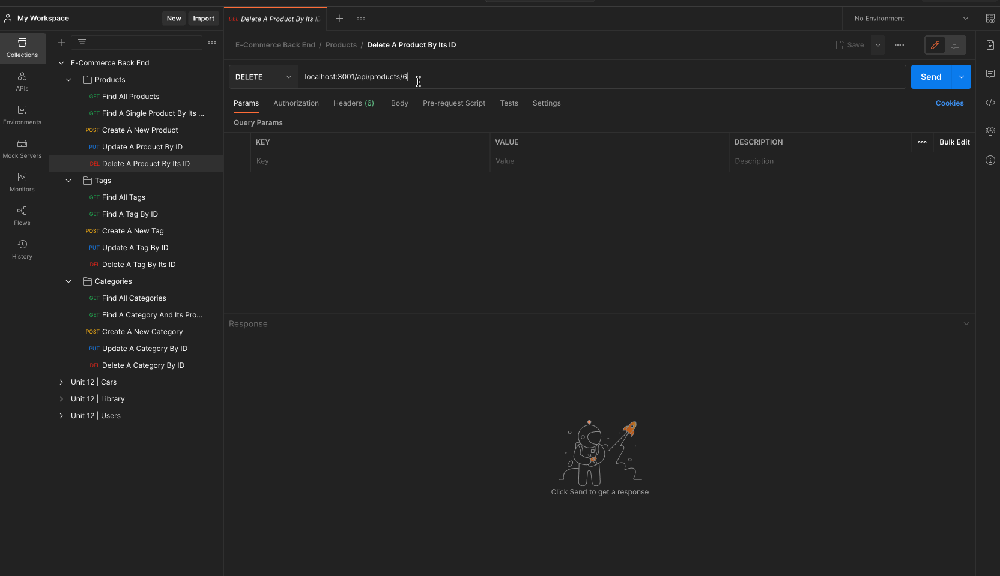

# e-commerce-back-end

## Description
An application that allows a user to manage an E-Commerce database.

## Demo

Run seed to populate database and start server

Getting all Categories, Products, and Tags

Getting Categories, Products, and Tags by an ID

Create new Categories, Products, and Tags

Update Categories, Products, and Tags

Delete Categories, Products, and Tags

## Table of Contents
* [Installion](#installation)
* [Run Application](#run-application)
* [Technologies](#technologies)
* [Questions](#questions)

## Installation
To install necessary dependencies, run the following command:
> npm i

## Run-Application
To seed the database before starting the application, run the following command: 
> npm run seed

To start the application, run the following command:
> npm start

## Technologies
The main technologies used here were Sequelize, MySQL2, and express.js.

## Questions
If you have any questions about the repo, open an issue or contact me directly through [email](business.dmjacob@gmail.com). You can find more of my work at [dylanjacob76](https://github.com/dylanjacob76).